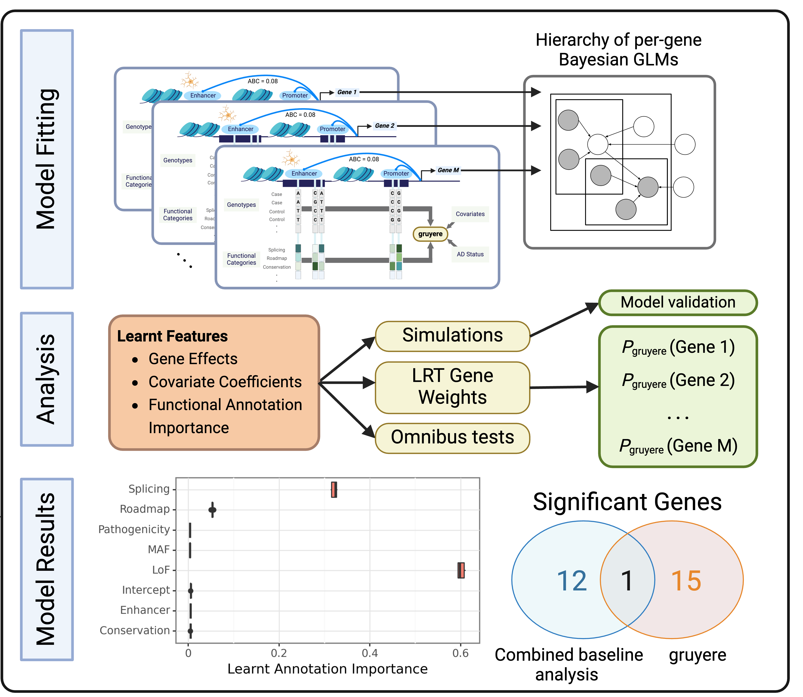

# gruyere: Genome-wide Rare Variant EnRichment Evaluation 

We develop a genome-wide rare variant association test designed for identifying trait-associated loci and functional annotations. This repository accompanies our recent preprint: **Leveraging functional annotations to map rare variants associated with Alzheimer’s disease with gruyere**.




## Installation

gruyere is written in Python. You can load gruyere along with required dependencies with the following:

``` r
git clone https://github.com/daklab/gruyere.git
cd gruyere
pip install -r requirements.txt OR conda create --name gruyere --file requirements.txt
```

## Overview: Inputs and Outputs
**Model Inputs** 
- `G`: Genotypes for N individuals and P variants [P x N]. Index should contain gene name that variant maps to. Can optionally include variant id "gene_variantID"
- `Z`: Functional annotations for P variants and Q annotations [P x Q]. Index should contain gene name that variant maps to. Can optionally include variant id "gene_variantID"
- `XY`: Individual-level covariates for N individuals and C covariates [NxC] and "Diagnosis" column for binary or continuous phenotypes

**Model Outputs (Joint analysis)**
- `alpha.csv`: Learned covariate weights by gene
- `tau.csv`: Learned genome-wide annotation weights
- `wg.csv`: Learned gene weights (mean and standard deviation)
- `losses.txt`: Loss per epoch
- `train_performance.csv`: AUC and accuracy of predictions by gene on training set
- `test_performance.csv`: AUC and accuracy of predictions by gene on held-out test set (optional; if using test set)


## Example:
- `example_data/inputs.yaml` contains example inputs: 

```
---
output: '../example_outputs/' # Path where outputs are saved
XY: '../example_data/XY.csv' # File with covariates (X) and phenotypes (Y)
G: '../example_data/genotypes/' # Path to genotypes, per chromosome
Z: '../example_data/annotations/' # Path to annotations, per chromosome
epochs: 300 
n_samples: 50 # Number of times to sample the posterior to determine mean/standard deviation estimates
test_prop: 0.2 # Test set proportion
lr: 0.1
genes: '../example_data/joint_analysis_genes.txt' # List of genes to perform joint analysis on (we use FST)
simulate: False 
```

**Scripts**
- `models.py`: contains model classes for joint and per-gene gruyere training
- `data_class`: processes input data and stores as dataclass object
- `load_data`: functions to load input data
- `utils.py`: utility functions
- `performance.py`: calculates AUROC and accuracy on gruyere predictions
- `gruyere_joint.py`: fits joint gruyere model
- `gruyere_pergene.py`: fits per-gene gruyere regression

``` r
sbatch example_bash/joint_analysis.sh
sbatch example_bash/per_gene.sh
```

